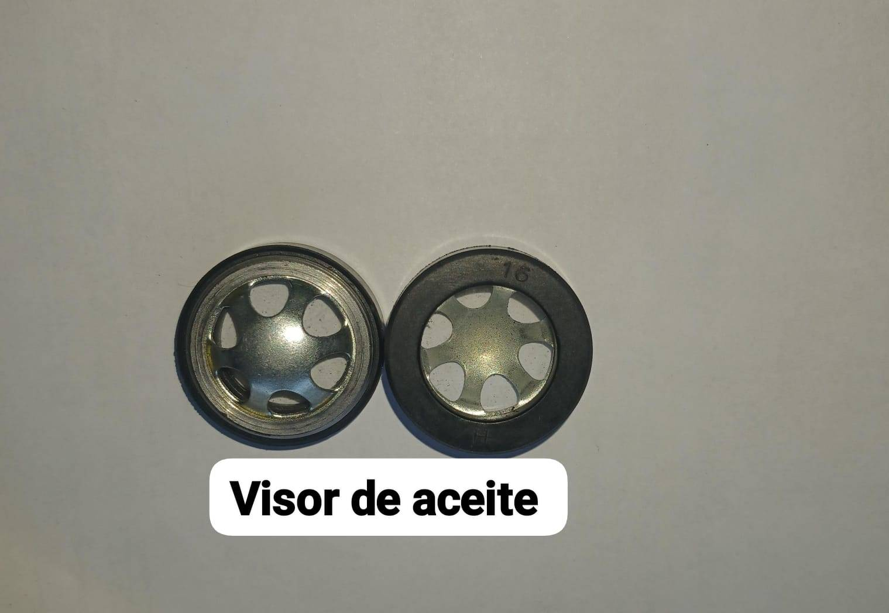
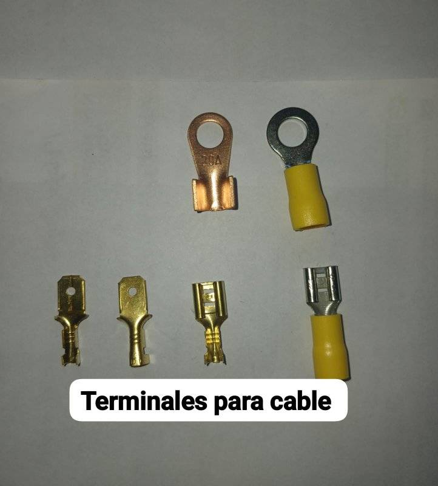
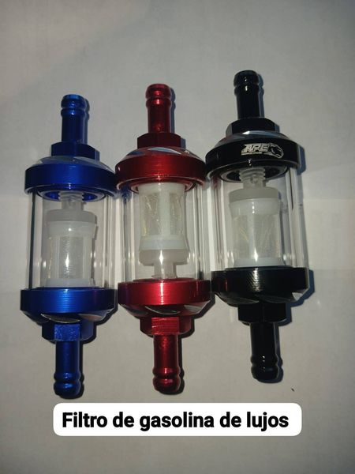

# catalogo

<html lang="es">
<head>
    <meta charset="UTF-8">
    <meta name="viewport" content="width=device-width, initial-scale=1.0">
    <title>Catálogo con Filtros</title>
    
</head>
<body>
    

        <label for="category">Filtrar por categoría:</label>
        <select id="category" onchange="filterItems()">
            <option value="all">Todos</option>
            <option value="electronics">cascos</option>
            <option value="clothing">guantes</option>
            <option value="books">llantas</option>
                <option value="books">accesorio</option>
        </select>
    

    

        

            
            <h3>accesorio de moto  </h3>
            
accesorio.

        

        

            
            <h3>accesorio de moto  </h3>
            
acessorio.

        

        

            
            <h3>accesorio de moto</h3>
            
accesorio

        

 

            
            <h3>accesorio de moto</h3>
            
accesorio

        

 

            
            <h3>accesorio de moto</h3>
            
accesorio

        

 

            
            <h3>accesorio de moto</h3>
            
accesorio

        

 

            
            <h3>accesorio de moto</h3>
            
accesorio

        

        <!-- Añade más elementos de catálogo aquí -->
    

    
</body>
</html>

<html lang="es">
<head>
    <meta charset="UTF-8">
    <meta name="viewport" content="width=device-width, initial-scale=1.0">
    <title>Imagen de Fondo</title>
    
</head>
<body>
    <h1>¡Hola Mundo!</h1>
    
Este es un ejemplo de una página con una imagen de fondo.

</body>
</html>

